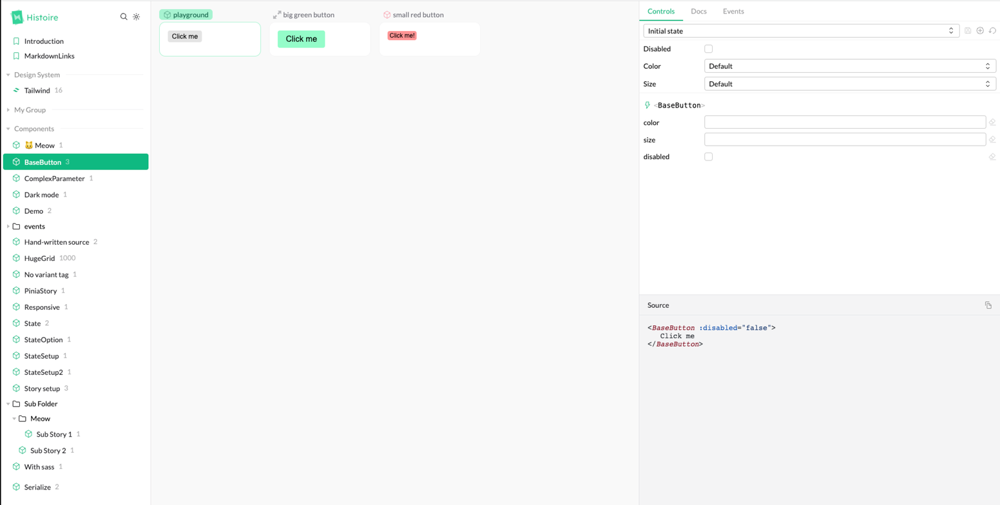
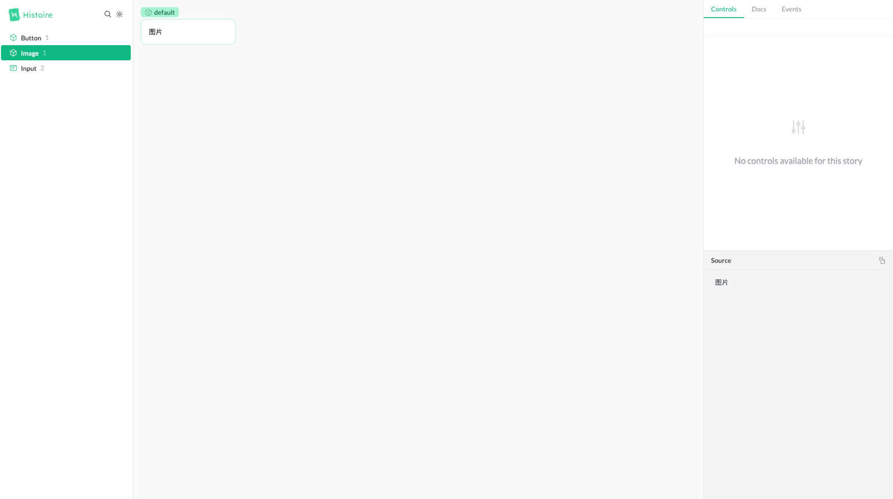
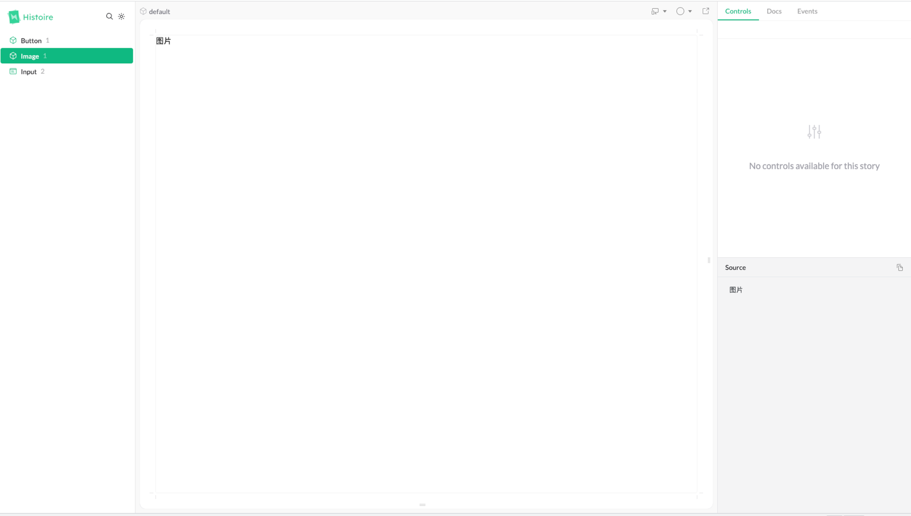
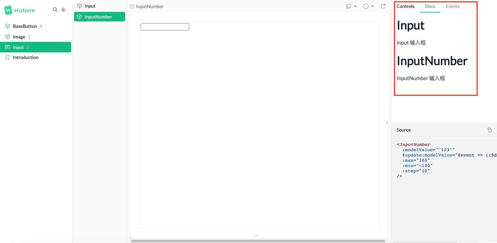
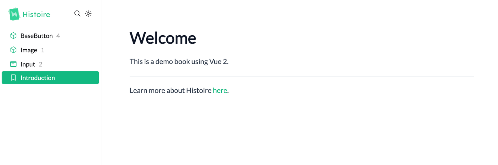

# 介绍


Histoire是一个新发布的易于上手和开发的组件库文档搭建工具，目前仅支持基于Vue和Svelte框架搭建。



# 优势

基于 Vite，通过重用 Vite 的配置，减轻开发者的配置负担，可以花更多的时间在内容编写上。

1. 良好的 UI 外观展示。

2. 使用 Vite 即时服务器启动，修改热更新等。

3. 响应式测试，支持调整预览的窗口大小，支持自定义多种 prop 预设。

4. 支持更改主题背景，包括白天/夜晚模式，支持预览窗口的背景色。

5. 快速模糊搜索

[官网 DEMO](https://vue3.examples.histoire.dev/story/src-components-introduction-story-vue?variantId=_default)

# 缺点

1. 目前不支持 Vue2.6 的版本，支持 Vue2.7 及 Vue3 的版本

2. 依赖于 Vite 构建，无法使用其他构建工具。

3. 尚未发布较为正式的版本，目前处于 dev 阶段。

# 用法介绍

## 安装及配置

```
pnpm add histoire @histoire/plugin-vue -D
```

添加配置文件 histoire.config.js

```
// histoire.config.js
import { defineConfig } from "histoire";
import { HstVue } from "@histoire/plugin-vue";

export default defineConfig({
  // your Histoire configuration
  plugins: [new HstVue()],
});
```

修改 package.json 文件，添加 script 命令

```
"scripts": {
  "story:dev": "histoire dev",
  "story:build": "histoire build",
  "story:preview": "histoire preview"
}
```

## 组件文档实现

以 Input 组件为例，在对应的组件目录下，新建一个 Input.story.vue 文件，在该文件中编写组件相关的文档说明和实例代码。

Histoire 提供了 Story、Variant 两个内置组件，方便用户来构建组件文档的结构。

```
<template>
  <!--Story的title属性对应目录的标题-->
  <Story title="Input" :layout="{ type: 'grid', width: 200 }">
    <!--Variant用于创建组件的变体-->
    <Variant title="InputNumber"> 数字输入框 </Variant>
    <Variant title="Input"> 输入框 </Variant>
  </Story>
</template>
```



### 1. 内置组件说明

**Story 组件说明**

Story 组件要在*.story.vue 组件的根节点，每个*story.vue 组件都有一个对应的 Story 标签包裹具体的内容。Story 支持一下属性：

1. title：当前组件的文档主标题

2. init-state：初始化组件默认 props 的回调函数，当不存在变体的时候适用。

3. layout：当组件存在多个变体组件时（使用 Variant 包裹不同的变体内容），可以配置 layout 来确定布局方式，包含两种一种是默认的 single，一种是 grid 布局。还支持配置 width，iframe 等，具体看官方文档。

Grid 布局


single 布局


4. icon：设置标题前面的 icon，icon 配置参考 （看 demo 好像不仅仅支持这一个 icon 体系）。

5. icon-color:设置标题的颜色

```
<template>
  <!--Story的title属性对应目录的标题-->
  <Story title="Input" :layout="{ type: 'grid', width: 200 }" icon="carbon:account">
    <!--Variant用于创建组件的变体-->
    <Variant title="InputNumber"> 数字输入框 </Variant>
    <Variant title="Input"> 输入框 </Variant>
  </Story>
</template>
```

**Variant 组件说明**

Variant 组件主要用于某个组件存在多种变体的场景，比如 Select 可能有多种业务组件变体等。

Variant 组件 props 说明：

1. title：变体的名称

2. init-state: 组件状态初始化函数，设定组件默认展示的 props 值。

3. icon：设置变体名称前面的图标

4. icon-color：设置图标颜色

除了上面的两个常规组件之外，Histoire 还提供自己封装的一些基础组件，如 HstCheckbox、HstSelect、HstRadio 等，用来满足常规的配置表单的使用。具体详参这里。

### 2.组件属性控制

Histoire 默认会根据组件的 props 来自动生成对应的配置项，并根据 props 值的类型来生成对应的表单控件。此外，Histoire 也支持用户通过插槽来自定义 props 配置控件。

```
 <Variant title="playground" :init-state="initState">
      <template #controls="{ state }">
        <HstCheckbox v-model="state.disabled" title="Disabled" />
        <HstSelect
          v-model="state.color"
          title="Color"
          :options="[
            { value: undefined, label: 'Default' },
            { value: 'green', label: 'Green' },
            { value: 'red', label: 'Red' },
          ]"
        />
        <HstSelect
          v-model="state.size"
          title="Size"
          :options="[
            { value: undefined, label: 'Default' },
            { value: 'small', label: 'Small' },
            { value: 'big', label: 'Big' },
          ]"
        />
      </template>
    </Variant>
```

当采用插槽的时候，会出现一个预设下拉框，方便用户自定义一组预设值，并存到 localStorage 中。当 controls 插槽代码作为<Story>的子元素存在时，将会影响到所有的变体。

### 3.MarkDown 支持

Histoire 也支持在\*.story.vue 文件中编写 markdown 文本。具体如下：

```
//Input.story.vue文件
<docs lang="md">
# Input

input 输入框

# InputNumber

InputNumber 输入框
</docs>
```

最终展示的效果如下：


除了支持在 vue 文件中编写文档之外，还同时支持编写组件对应的 md 文件，但是要以 story.md 文件结尾。同样以 Input 组件举例：对应目录下创建一个 Input.story.md 文件，文件内容最终也会展示在 docs 里面。当同时在 vue 文件中使用了 docs 和创建了*.story.md 文件时，vue 文件中的文档内容将会覆盖*.story.md 文件的文档内容。

Histoire 也支持直接创建不依赖于组件的 md 文件，例如新建一个 Introduction.story.md 文件，最终的展示如下：

参考资料

https://histoire.dev/

https://github.com/histoire-dev/histoire

https://vue3.examples.histoire.dev/
